# Higher or Lower?
'Higher or Lower?' is a classic, fun and incredibly simple game that most of us have played in our lives but  normally with playing cards. This site has taken this straightforward concept and digitised it. Using pure JavaScript for the logic and supported by HTML and CSS, it allows the user to feel the same adrenaline rush experienced when deciding if the next number will be higher or lower. It is fully responsive and accessible on all devices. 

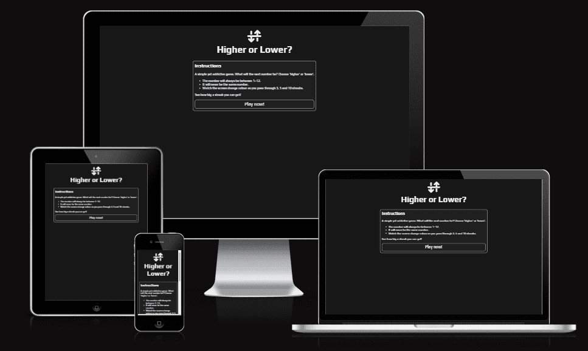

[Source: https://jdohertydev.github.io/higher-or-lower-v2/]

## Early development
Before starting, a basic wireframe was developed using balsamiq which helped visualise the website.

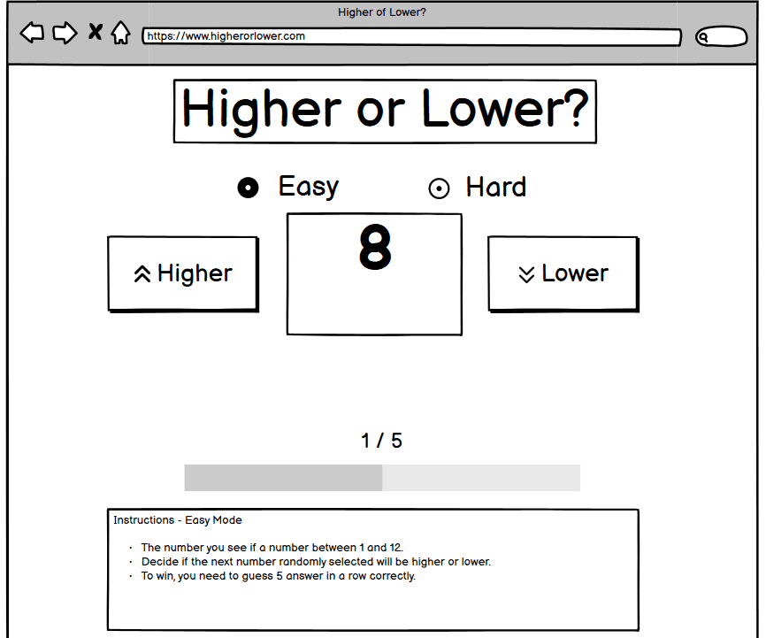

## Technologies used
Based on the information given by GitHub, this project uses:

* JavaScript - 27.9% 
* HTML - 19.8%
* Dockerfile - 19.0% 
* CSS - 16.6% 
* Python - 8.9% 
* Shell - 7.8%

## Features

### Existing Features
* Simple colour scheme
    * At the heart of the game's design is simplicity and this starts with the colour scheme used. A simple yet elegant black and white interface combines with the "Play" font which gives this game a retro, arcade feel. 

* Logo and Heading
    * The logo and heading are centred at the top of the page which makes it easy for the user to see. The logo, which combines the '+' and '–' symbols, adds a visual element which breaks up the text. 

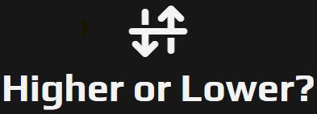

* Favicon
    * The Favicon is a mirror image of the logo, which keeps design elements consistent.

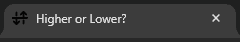

* Instruction box
    * The instruction box is the first and only thing that the user sees so to not overwhelm or distract them. The language used is persuasive to entice the user to play and it clearly outlines the game's objectives, which the user will read before clicking the 'play now' button and entering the game.
    * When the user has clicked the 'play now' button, the instructions are hidden to maximise the game area.

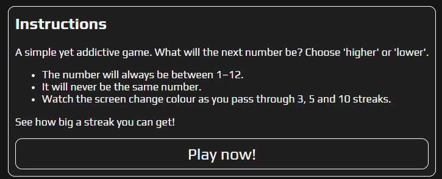

* Game area
    * The user is presented with a simple interface; a randomly generated number, 'up' and 'down' icons from FontAwesome which are purposely placed on top of each other for good design, as well as 'higher and 'lower' text. 
    * The 'higher' and 'lower' text element is removed when viewed on smaller viewports to avoid the text wrapping.

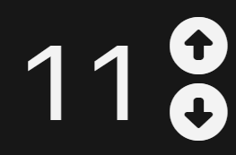

* The buttons and text are clickable with the cursor changing to pointer and trigger an onEvent action in JavaScript. 
* The keystrokes for 'up' and 'down' have been enabled so users using a keyboard can bypass clicking.

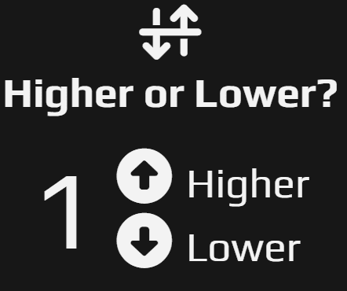

* Area to say if the answer is correct or incorrect
     * If the user gets the answer correct, a green 'Correct' text is displayed however if the answer is incorrect, a red 'Incorrect' text is displayed. These colours are traditionally used in this context.

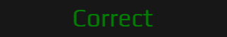

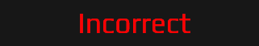

* Score area
    * The score area is logically placed at the bottom of the game area which shows the user's current and highest streak.

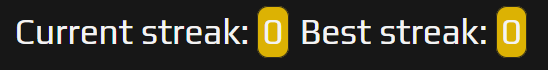

* On smaller viewports, the font size is reduced to accommodate the content.

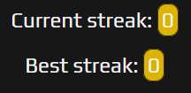
  
* To add an element of progress, JavaScript is used to change the page background colour depending on the user's streak (3 changes to bronze, 5 changes to silver and 10 changes to gold).

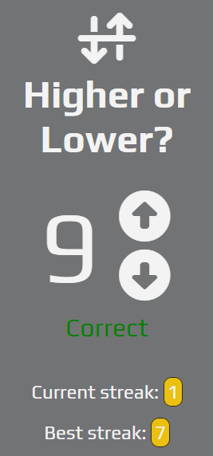
    
### Features Left to Implement
* Transitioning text
    * Within the game area, having the answer status transition in and out would improve the visual aesthetics. This proved a bit too technical at this stage.

## Testing
* This site has been tested on a Windows 11 desktop version of Chrome, Firefox and Edge.
* Using Chrome Dev Tools, simulations of mobile and tablet viewports have also been tested with no display errors.

### Screenshots of the website on different devices

#### Mobile Device

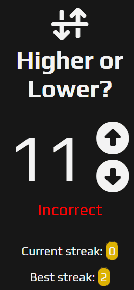

#### Tablet

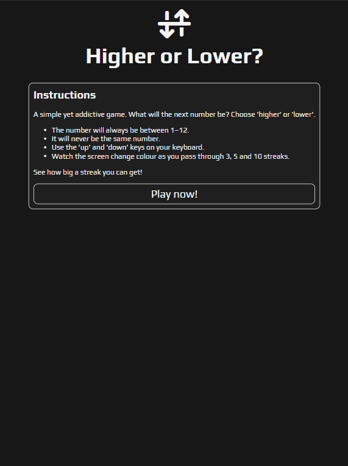

#### Laptop

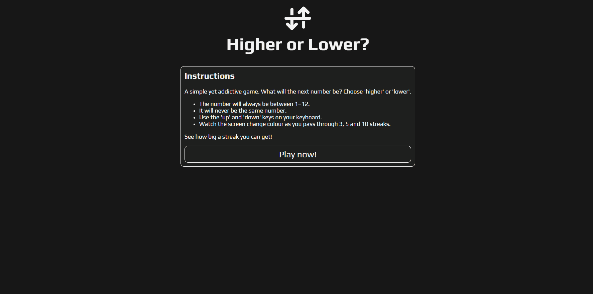

### Validator Testing

#### HTML
* No HTML errors are returned when passing through [The W3C Markup Validation Service](https://validator.w3.org/nu/?doc=https%3A%2F%2Fjdohertydev.github.io%2Fhigher-or-lower-v2%2F).

#### CSS
* No CSS errors are returned when passing through [The W3C CSS Validation Service - Jigsaw](https://jigsaw.w3.org/css-validator/validator?uri=https%3A%2F%2Fjdohertydev.github.io%2Fhigher-or-lower-v2%2Fassets%2Fcss%2Fstyle.css&profile=css3svg&usermedium=all&warning=1&vextwarning=&lang=en).

#### JavaScript
* No errors were found when passing through the official [Jshint validator](https://jshint.com/).
* The following metrics were returned:
    * There are **12** functions in this file.
    * Function with the largest signature takes **1** arguments, while the median is **0**.
    * Largest function has **8** statements in it, while the median is **2.5**.
    * The most complex function has a cyclomatic complexity value of **5** while the median is **2**.

### Accessibility
* This site was developed with a colour scheme that is visually appealing but also very minimal, always considering the accessibility of the user.
* Using Lighthouse, this site scored an accessibility rating of **100** and a **100** performance rating overall.

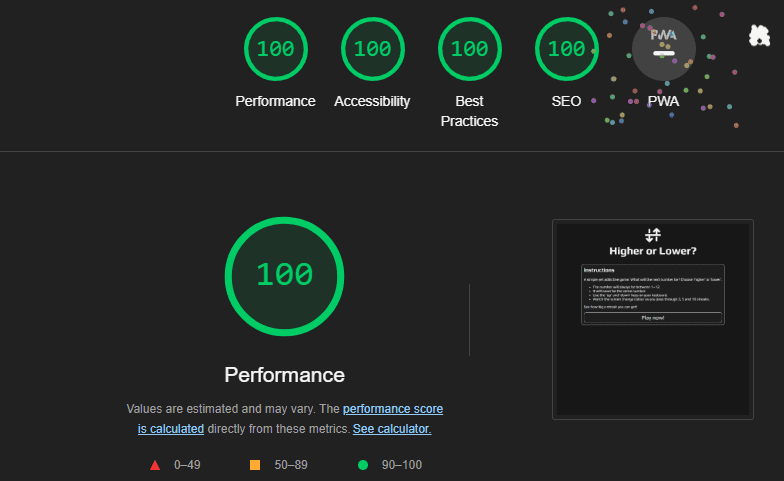

## Unfixed Bugs
* There are no unfixed bugs in this project.

## Deployment
* This site was created using GitPod and deployed to GitHub.
    * In the GitHub repository, navigate to the Settings tab.
    * From the source section drop-down menu, select the Master Branch.
    * Once the master branch has been selected, the page will be automatically refreshed with a detailed ribbon display to indicate the successful deployment.
* The live link is ['Higher or Lower'?](https://jdohertydev.github.io/higher-or-lower-v2/).

## Credits

### Content

* The idea for the game came from [DAY 8 - How to code a Number Game in Javascript](https://www.youtube.com/watch?v=kMmtRm4P_EE&t=1205s) and some of the design features draw similarities.
* The website used to make the Favicon was [Favicon Converter](https://favicon.io/favicon-converter/).
* The icons in the page were taken from [Font Awesome](https://fontawesome.com/).
* Along the way, I was helped by my mentor as well as tutor support.